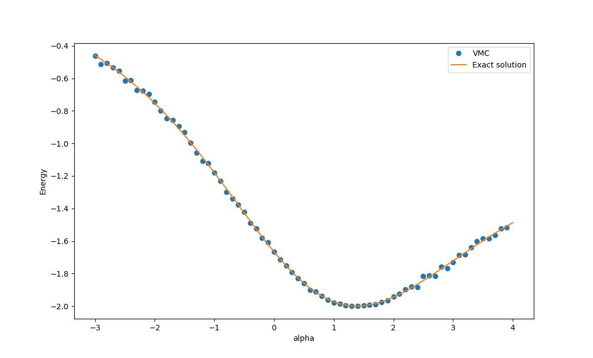
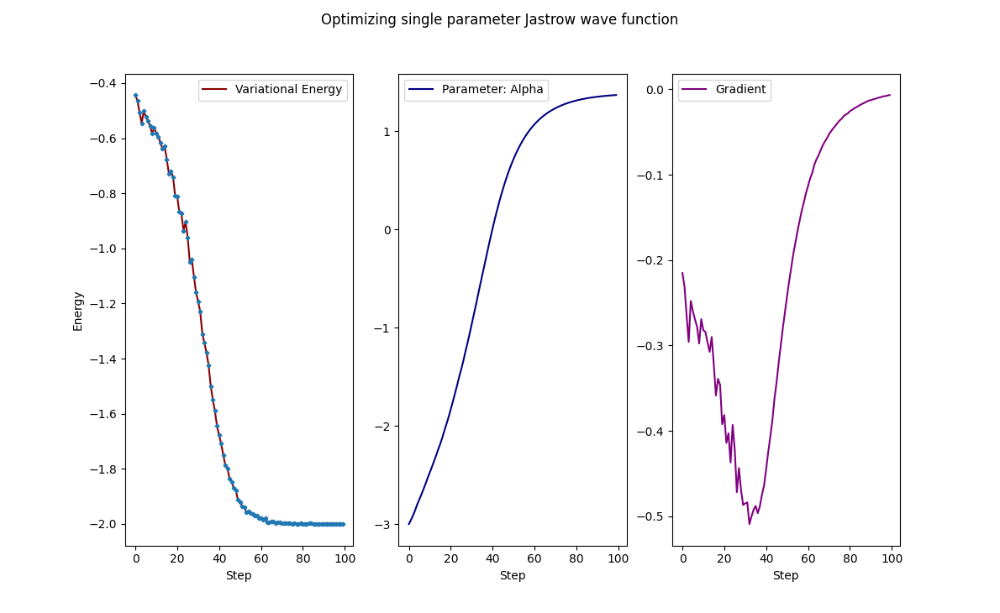
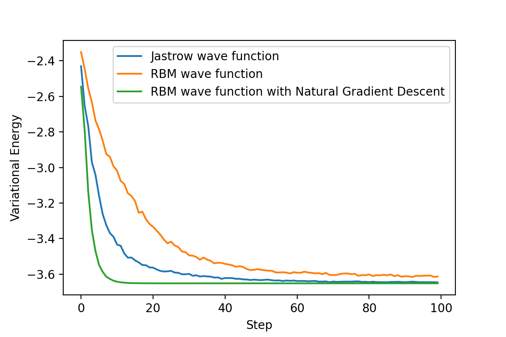

# Neural Network Quantum State

This is a Python implementation of neural network quantum state introduced in the paper "Solving the quantum many-body problem with artificial neural networks". 

Required library: `Numpy, Numba, MPI4Py, Matplotlib`

Hamiltonian

$$ \hat{H}=\sum_{i=1}^{N-1}
\hat{S}^z_i \hat{S}^z_{i+1} -
\frac{1}{2}\left[
\hat{S}^+_i \hat{S}^-_{i+1} +
\hat{S}^-_i \hat{S}^+_{i+1}
\right]$$

Trial wave function 

$$|\psi_t(\alpha)\rangle=\sum_x\langle x|\psi_t(\alpha)\rangle|x\rangle=\sum_x J_x(\alpha)|x\rangle$$

Variational energy

$$\langle E\rangle_t=\frac{\langle\psi_t|H|\psi_t\rangle}{\langle \psi_t|\psi_t\rangle}=\frac{\sum_x\langle\psi_t|x\rangle\langle x||H|\psi_t\rangle}{\sum_x\langle\psi_t|x\rangle\langle x||\psi_t\rangle}
$$

Jastrow wave function with single parameter

$$ C(\alpha, \vec{s})=e^{-\alpha\sum_{i < j}\frac{\hat{S}^z_i \hat{S}^z_j}{|j-i|}}$$

On a 4 sites chain, the variational energy can be calculated analytically. Here is the comparison of the exact results with variational Monte Carlo results. 

### Optimize the sigle parameter Jastrow wave function

Gradient descent:

$$ \alpha = \alpha-\lambda\frac{\partial E}{\partial\alpha}$$

$$ \frac{\partial E}{\partial\alpha}=2\frac{\langle\frac{\partial\psi}{\partial\alpha}|H|\psi\rangle}{\langle\psi|\psi\rangle}-2E\frac{\langle\frac{\partial\psi}{\partial\alpha}|\psi\rangle}{\langle\psi|\psi\rangle}$$

Define

$$ O = \frac{1}{|\psi\rangle} |\frac{\partial\psi}{\partial\alpha}\rangle$$

Then

$$ \frac{\partial E}{\partial\alpha}=2\frac{\langle\psi|OH|\psi\rangle}{\langle\psi|\psi\rangle}-2\langle E\rangle\frac{\langle\psi|O|\psi\rangle}{\langle\psi|\psi\rangle}=2\langle EO\rangle-2\langle E\rangle\langle O\rangle$$

### More complicated wave function

Jastrow wave function

$$J(\alpha_{ij}, \vec{s})=e^{-\sum_{ij}\alpha_{ij}{\hat{S}^z_i \hat{S}^z_j}} $$

Restricted Boltzman machine wave function

$$ \psi(\vec{s}, a, b ,W) = e^{ \sum^N_{i=1} a_i s^z_i } \prod_{i=1}^M 2\cosh{(\sum_{j=1}^N W_{ij}s^z_j + b_i)} $$

All the parameters in the wave function are complex numbers. 

### Optimize the Restricted Boltzman Machine wave function

In the modified natural gradient descent method, the Fubini-study
metric, which is the complex-valued form of Fisher information, is used to measure the "distance" between wave functions |ψ〉 and |φ〉. NGD can greatly improve the convengence speed as shown below. 

$$\begin{equation}
    \gamma(\psi,\phi)=\arccos{ \sqrt{ \frac{\langle\psi|\phi\rangle\langle\phi|\psi\rangle}{ \langle\psi|\psi\rangle\langle\phi|\phi\rangle }} }.
\end{equation}$$

